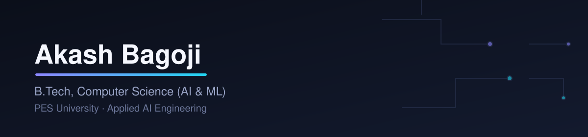

  
 

 

 
## About Me
 
- 🎓 3rd-year B.Tech, Computer Science (AI & ML), PES University, RR Campus (2024 – 2028)
- 🚀 **DevSpace Tech Intern @ BSERC (ISRO)** — Software / AI Engineering
- 🔬 **R&D Member @ PI Labs, PESU** — built **Socratic Mirror**, an LLM-powered reflective tutoring platform
- 🏆 200+ problems on LeetCode · 170+ on Codeforces (rating ~1120) · Reliance Foundation & FFE Scholar
- 🛰️ Currently building for **Smart India Hackathon 2025** — predictive ML for water-borne disease early-warning systems
- ⚡ Ships full-stack, production-shaped AI systems: fraud detection, graph-based financial crime intelligence, and test automation frameworks — not tutorial projects
 
## Tech Stack
 

 
## Experience
 
<table>
<tr><td width="160"><b>BSERC (ISRO)</b></td><td>DevSpace Tech Intern — Software / AI Engineering</td></tr>
<tr><td><b>PI Labs, PESU</b></td><td>R&D Member Building <b>Socratic Mirror</b>: prompt architecture and conversational state management for an LLM-powered Socratic tutoring tool.</td></tr>
<tr><td><b>Decode Labs</b></td><td>R&D Intern — Generative AI & Cybersecurity AI / Software Engineering across the generative AI domain.</td></tr>
</table>
 
## Featured Projects
 
<table>
<tr>
<td width="50%" valign="top">
**[VigilNet](https://github.com/akashsb2005/VigilNet)**
Real-time AML & financial crime network intelligence platform — Graph Attention Networks over transaction graphs, explainable risk scoring, and LLM-generated SAR narratives.
`GNN` `PyTorch Geometric` `FastAPI` `React`
 
</td>
<td width="50%" valign="top">
**[SentinelAI](https://github.com/akashsb2005/SentinelAI)**
AI-powered document & identity fraud detection platform, built for investigators. Every finding ships with a confidence score and a plain-English rationale. 10/10 tests passing in CI.
`FastAPI` `PostgreSQL` `React` `PyTorch`
 
</td>
</tr>
<tr>
<td width="50%" valign="top">
**[NexusQA](https://github.com/akashsb2005/NexusQA)**
Enterprise-grade test automation framework — Selenium + TestNG + REST Assured across UI, API, and PostgreSQL layers, with a containerized Selenium Grid and automated CI/CD Allure reporting.
`Java` `Selenium` `TestNG` `Docker`
 
</td>
<td width="50%" valign="top">
**[Socratic Mirror](https://github.com/akashsb2005/socratic-mirror)**
LLM-powered Socratic tutoring platform (React/Vite/Tailwind + FastAPI + Supabase + Groq) that escalates learners through cognitive-depth levels instead of giving direct answers.
`React` `FastAPI` `LLM`
 
</td>
</tr>
<tr>
<td width="50%" valign="top">
**[Industrial Knowledge Intelligence](https://github.com/akashsb2005/industrial-knowledge-brain)**
Multi-agent RAG system built for ET AI Hackathon 2.0 (PS8) — ChromaDB + Groq llama-3.3-70b + LangChain over an industrial knowledge base.
`Python` `RAG` `LangChain`
 
</td>
<td width="50%" valign="top">
**[VulTriage](https://github.com/akashsb2005/vultriage)**
LLM-powered vulnerability triage tool using regex scanning, GitPython, and Groq.
`Python` `Security`
 
</td>
</tr>
</table>
 
## GitHub Analytics
 

> Fully self-generated via GitHub Actions — no third-party service, no downtime, updates itself daily. Setup in `metrics.yml`.
 
 
## Contribution Snake
 

 
## Achievements
 

 

<i>Open to applied AI/ML, backend, and research internship roles — let's talk.</i>

 
